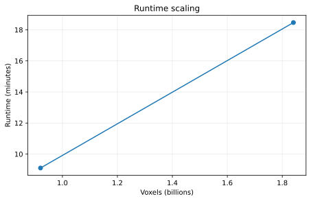
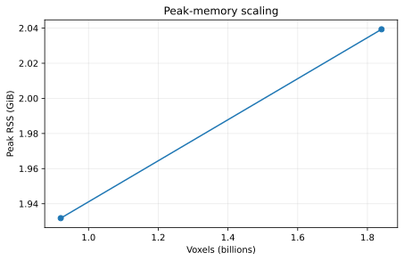
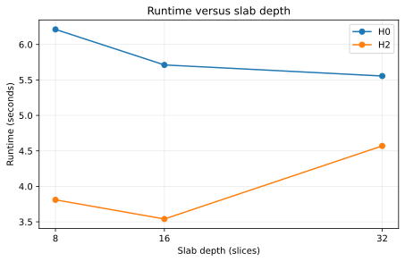

# stream_betti_curves

[](https://github.com/jhnrckmnznrs/stream_betti_curves/actions/workflows/ci.yml)
[](https://github.com/jhnrckmnznrs/stream_betti_curves/actions/workflows/benchmarks.yml)
[](LICENSE)

**A memory-efficient parallel Rust engine for exact topological summaries of large 3-D image volumes.**

`stream_betti_curves` computes exact Betti-0 / Betti-2 curves, persistence intervals, and elder-rule branch summaries directly from grayscale TIFF stacks. It is designed for volumes that are too large to keep as one global topology problem in RAM: local slabs are reduced with union-find, interfaces are summarized, and scalar workloads can be reconciled with disk-backed hierarchical fan-in. The optimized hierarchical persistence reconciler now accepts integer U8/U16 and F64 stacks through the exact wide-key path, while F32 retains its native-width fast path.

The repository emphasizes three engineering properties:

- **Exactness.** Optimized paths are checked against independent or simpler reference implementations and across slab decompositions.
- **Bounded memory.** Hierarchical H0/H2 reconciliation keeps the pairwise interface frontier bounded by the outer faces being merged instead of all slab interfaces accumulated so far.
- **Reproducible performance.** Benchmark scripts record wall time, peak RSS, filesystem I/O, scratch usage, configuration, and persistence fingerprints.

> Repository rename note: the project is now presented as `stream_betti_curves`. The executable remains `betti_curves` for backward compatibility with existing research and validation scripts.

## Measured engineering results

These are **measured development results**, not theoretical projections. Historical runs predate explicit thread-count capture; the new benchmark suite records `RAYON_NUM_THREADS` so future releases can publish thread-scaling plots. Raw measurements are committed under [`benchmarks/data/`](benchmarks/data/).

| Volume | Topology / algorithm | Slab | Threads | Runtime | Peak RAM | Peak scratch |
|---|---|---:|---:|---:|---:|---:|
| 274×274×448 (CX09T1) | H0 hierarchical + elder pruning | 8 | not recorded | 6.21 s | 15.7 MiB | — |
| 274×274×448 (CX09T1) | H2 hierarchical + direct cross + outside pruning | 16 | not recorded | 3.54 s | 20.4 MiB | — |
| 3792×3792×64 real F32 prefix | H0 hierarchical + elder pruning | 8 | not recorded | 546.3 s | 1.93 GiB | 3.86 GiB |
| 3792×3792×128 real F32 prefix | H0 hierarchical + elder pruning | 8 | not recorded | 1108.0 s | 2.04 GiB | 4.22 GiB |

The 64→128-slice real-volume test doubled the voxel count from 0.92 to 1.84 billion while peak RSS increased only from 1.93 to 2.04 GiB. That is the practical motivation for the hierarchical architecture.

<p align="center">
  
  
</p>
<p align="center">
  
</p>

See [`docs/benchmarks.md`](docs/benchmarks.md) for provenance, limitations, and reproduction commands.

## Architecture at a glance

<p align="center">
  
</p>

For large F32 scalar workloads, the core pipeline is:

1. read a z-slab of TIFF slices;
2. convert scalar values to exact order-preserving keys;
3. sweep voxels in filtration order with a compact union-find;
4. finalize persistence pairs that can no longer be affected by neighboring slabs;
5. export only the two surviving z-faces plus sparse connectivity events;
6. combine adjacent summaries with an online binary fan-in;
7. discard consumed child runs immediately;
8. reduce the final pair directly, without materializing a whole-volume root summary.

The pairwise hierarchical H0/H2 state is bounded by at most four face areas. For native F32 with packed parent/rank state, the explicit pair state is 8 bytes per interface node.

Read [`docs/architecture.md`](docs/architecture.md) for the invariants, event ordering, outside-component model, and memory model.

## What it computes

For an image value function `I(v)`, foreground voxels enter the sublevel filtration

```text
X_t = { v : I(v) <= t }.
```

The engine provides:

- **Betti-0**: connected components of `X_t`;
- **Betti-2**: enclosed background components under the dual background connectivity and a distinguished outside component;
- **H0 / H2 persistence intervals**;
- **elder-rule branch trees** for selected modes;
- sparse Betti-curve CSVs reconstructed from persistence intervals.

Foreground connectivity is either 6 or 26; H2 uses the dual background connectivity (26 or 6 respectively). Persistence intervals use half-open `[birth, death)` semantics. H0 essential intervals are written with `death=inf`.

## Input

A volume is a directory containing one single-page grayscale TIFF per z-slice:

```text
volume/
├── slice_0000.tif
├── slice_0001.tif
├── slice_0002.tif
└── ...
```

Natural numeric filename ordering is used. All slices must have identical width, height, and pixel type.

Scalar modes accept finite U8, U16, F32, and F64 values. F32/F64 ordering is exact with respect to the stored values; `-0.0` and `+0.0` are treated as the same filtration value and NaN/±infinity are rejected.

## Build

Rust 1.88.0 is pinned in [`rust-toolchain.toml`](rust-toolchain.toml), and the dependency lockfile is committed.

```bash
git clone https://github.com/jhnrckmnznrs/stream_betti_curves.git
cd stream_betti_curves
cargo build --release --locked
```

The backward-compatible executable is:

```text
target/release/betti_curves
```

For development:

```bash
cargo fmt --all -- --check
cargo clippy --all-targets -- -D warnings
cargo test --all-targets
```

The same checks run in GitHub Actions.

## Recommended large-volume modes

The code retains simple/reference implementations alongside optimized paths. For large F32 persistence workloads, the most scalable modes are:

### H0

```bash
BETTI_TEMP_DIR=/path/to/fast/scratch \
target/release/betti_curves \
  /path/to/slices \
  8 26 h0-scalar-hierarchical-stream h0.csv \
  --f32-key-mode native32 \
  --h0-birth-buffer reuse-input \
  --h0-event-storage direct \
  --global-h0-uf-layout packed \
  --h0-hier-attach-pruning elder-dominated
```

### H2

```bash
BETTI_TEMP_DIR=/path/to/fast/scratch \
target/release/betti_curves \
  /path/to/slices \
  16 26 h2-scalar-hierarchical-stream h2.csv \
  --f32-key-mode native32 \
  --local-h2-birth-state compact \
  --global-h2-birth-state compact \
  --global-h2-uf-layout packed \
  --h2-hier-cross-storage direct \
  --h2-hier-outside-structural-pruning outside-dominated
```

Slab depth is workload-dependent. Smaller slabs reduce local memory; larger slabs reduce the number of interfaces. Benchmark d8/d16/d32 on a representative prefix rather than assuming one global optimum.

The experimental integer branch-tree leaf reducer now uses compact packed UF state and a local elder-voxel ID instead of storing a full branch object at every voxel. It also uses the interior linear-offset neighborhood kernel already validated in the scalar path. The design goal is to make deeper leaves (especially d16/d32) cheap enough to fuse several former slabs at source, cutting seam reconciliation and repeated interface-tree replay rather than widening the upper hierarchy. See [`docs/compact-branch-tree-leaf-state.md`](docs/compact-branch-tree-leaf-state.md).

The experimental leaf-history fast path also keeps finalized local deaths in slab-local IDs and uses an exact one-bit watch filter before consulting the sparse provisional-parent map. On workloads where almost all leaf deaths have zero persistence, this turns the common history-contraction path into a bit test plus discard. Set `BETTI_HIER_LEAF_HISTORY_WATCH_FILTER=0` to disable the watch shortcut for A/B profiling. See [`docs/leaf-history-watch-filter.md`](docs/leaf-history-watch-filter.md).

The plateau-native leaf fast path goes one step earlier: a finite local branch born and killed at the current threshold is discarded at the union decision, so the zero-persistence history record is never constructed. Sequential activation is deliberately retained because the exact neighborhood pruner depends on it; interface/attach/Outside transitions are not suppressed. Set `BETTI_HIER_PLATEAU_NATIVE_LEAF=0` to restore the v15 behavior. See [`docs/plateau-native-leaf-elision.md`](docs/plateau-native-leaf-elision.md).

An opt-in leaf-kernel audit (`BETTI_HIER_LEAF_KERNEL_AUDIT=1`) reports exact neighborhood-pruning and union-find event counts plus sparse timing samples, without changing the v16 algorithm. It is intended to decide whether the next optimization should remove representative edges, specialize union-find, or reduce interface bookkeeping. See [`docs/leaf-kernel-audit.md`](docs/leaf-kernel-audit.md).

## Command-line families

The executable intentionally keeps reference and optimized implementations in one binary:

| Family | Purpose |
|---|---|
| `betti0`, `betti2`, `both` | simple threshold-wise curve baselines |
| `event-betti*-stream` | disk-backed event-based Betti curves |
| `event-betti*-scalar-stream` | exact scalar curve streams |
| `h0-scalar-stream`, `h2-scalar-stream` | exact flat scalar persistence |
| `h0-scalar-hierarchical-stream` | bounded-memory hierarchical H0 persistence |
| `h2-scalar-hierarchical-stream` | outside-aware hierarchical H2 persistence |
| `branch-tree-h0*`, `branch-tree-h2*` | elder-rule branch summaries |
| `branch-tree-h0-hierarchical` | bounded-interface plateau-canonical H0 branch tree |
| `branch-tree-h2-hierarchical` | bounded-interface plateau-canonical H2 branch tree |

Run:

```bash
target/release/betti_curves --help
```

for the full set of tuning and diagnostic switches.

## Correctness strategy

Performance work is accepted only after exact-equivalence checks. The repository contains three levels of validation:

1. **Rust unit tests** for local invariants, parsing, storage layouts, and reducers.
2. **CLI integration tests** using committed tiny TIFF fixtures.
3. **Independent Python oracles** for exhaustive tiny binary volumes and cross-implementation persistence checks.

Release-level checks include canonical persistence-multiset hashing so output row order cannot create false failures.

```bash
python3 -m pip install -r validation/requirements.txt
python3 validation/test_oracles.py
scripts/check_production_release.sh /path/to/representative/stack
```

See [`docs/validation.md`](docs/validation.md) and [`validation/README.md`](validation/README.md).

## Benchmarking

The public benchmark harness can generate deterministic TIFF data, run Rust configurations under `/usr/bin/time -v`, run a deliberately simple Python/SciPy baseline on small volumes, and produce CSV + SVG scaling plots.

```bash
python3 -m pip install -r benchmarks/requirements.txt
python3 benchmarks/generate_synthetic_stack.py \
  --output /tmp/betti-128 --shape 128 128 128 --seed 42

python3 benchmarks/run_suite.py \
  /tmp/betti-128 \
  --binary target/release/betti_curves \
  --modes h0-scalar-stream h2-scalar-stream \
  --slab-depths 8 16 32 \
  --threads 1 2 4 8 \
  --output benchmark_results.csv

python3 benchmarks/plot_results.py benchmark_results.csv \
  --output-dir benchmark_plots
```

For reproducibility from a clean checkout:

```bash
scripts/reproduce_benchmarks.sh
```

Criterion-based CLI microbenchmarks live in [`benchmarks/criterion/`](benchmarks/criterion/). Memory and filesystem I/O are measured separately because Criterion is not a memory profiler.

## Performance profiling

Linux flamegraph support is provided by [`scripts/profile_flamegraph.sh`](scripts/profile_flamegraph.sh). The script refuses to silently profile a debug binary and records the exact command beside the generated SVG.

```bash
cargo install flamegraph
scripts/profile_flamegraph.sh /path/to/slices 16 26 h2-scalar-hierarchical-stream
```

See [`docs/performance-profiling.md`](docs/performance-profiling.md) for interpretation guidance and the current known hot-path categories.

## Hierarchical branch trees

The branch-tree hierarchy extends the slab-summary architecture to elder-rule ancestry while removing equal-threshold event-order ambiguity through plateau-canonical parenting. Pairwise reconciliation remains bounded by a small multiple of one image face; the current final node table is still materialized in memory. See [`docs/branch-tree-hierarchy.md`](docs/branch-tree-hierarchy.md). The hierarchical leaf path also distinguishes genuinely boundary-state-changing attaches from internal branch deaths that can be finalized immediately; see [`docs/hierarchical-leaf-attach-pruning.md`](docs/hierarchical-leaf-attach-pruning.md). Finalized zero-persistence history is contracted online, including an experimental leaf-local staging path that prevents diagonal leaf deaths from entering central history; see [`docs/hierarchical-history-contraction.md`](docs/hierarchical-history-contraction.md).

## Repository layout

```text
src/                     Rust implementation
validation/              independent correctness oracles and equivalence gates
tests/                   end-to-end CLI integration tests
benchmarks/              deterministic data generation, benchmark harnesses, plots
benchmarks/criterion/    Criterion process-level microbenchmarks
docs/                    architecture, validation, benchmarks, release documentation
docs/development/        archived optimization investigations and experiment history
.github/workflows/        CI, benchmark, and tagged-release automation
scripts/                  production profiling and reproducibility helpers
```

## Releases and versioning

The project follows [Semantic Versioning](https://semver.org/). The current repository-ready version is **0.2.0**. Tagged `v*` releases are configured to build and attach binaries for Linux, macOS, and Windows through GitHub Actions.

See [`CHANGELOG.md`](CHANGELOG.md), [`docs/releasing.md`](docs/releasing.md), and [`docs/source-layout.md`](docs/source-layout.md). Repository-rename steps are documented in [`docs/github-migration.md`](docs/github-migration.md).

## Contributing

Start with [`CONTRIBUTING.md`](CONTRIBUTING.md). Performance pull requests should include:

- an exactness result against a reference path;
- wall-time and peak-RSS measurements;
- the benchmark command and input provenance;
- the effective `PROFILE_CONFIG` emitted by the binary;
- an explanation of the memory/runtime tradeoff.

## Related work and scope

The implementation shares common algorithmic ingredients with other cubical-persistence systems—union-find, local pruning, and dual foreground/background reasoning—but this repository is specifically organized around exact streaming/hierarchical summaries for large 3-D image stacks. See [`docs/related-work.md`](docs/related-work.md) for the claim boundary and literature notes.

## License

MIT. See [`LICENSE`](LICENSE).

### Experimental recursive branch-history contraction

The hierarchical branch-tree implementation can contract zero-persistence finalized history at every fan-in node before the summary is propagated upward. This extends leaf-local history contraction and is intended to keep root history close to the final branch-tree scale. Set `BETTI_HIER_RECURSIVE_HISTORY=0` to restore the v11 internal-history behavior for A/B validation. See `docs/hierarchical-recursive-history-contraction.md`.

### H2 exact root deduplication

The frozen v18 H2 leaf kernel keeps one active neighbor per pre-existing union-find root before union/action processing. Root deduplication is exact, allocation-free (fixed stack buffer), and enabled by default. It removes cycle edges that would otherwise become already-connected no-op unions without changing filtration order or branch-parent semantics. Set `BETTI_HIER_H2_ROOT_DEDUP=0` only for same-binary reference/ablation runs.

The v18 lazy 3x3x3 shell-component pruner is retained only as an **opt-in experimental ablation** because the measured extra shell-state traffic outweighed its reduction in UF work on CX09T1. Enable it explicitly with `BETTI_HIER_H2_SHELL_PRUNE=1`. With `BETTI_HIER_LEAF_KERNEL_AUDIT=1`, the profile reports `shell_*` and `root_dedup_*` counters. See `docs/h2-root-dedup-freeze.md` for the freeze decision and benchmark evidence.

### U16 hierarchical persistence key width

Hierarchical U16 H0/H2 persistence uses a compact four-byte exact key by default.
For a same-binary comparison with the v19 eight-byte `ScalarKey` path, set
`BETTI_PERSIST_U16_NATIVE_KEYS=0`. See `docs/u16-native-persistence-keys.md`.


### Native-U16 H0 persistence leaf parallelism

The optimized `h0-scalar-hierarchical-stream` native-U16 path can prepare independent leaf slabs in bounded parallel batches. Set `BETTI_PERSIST_H0_LEAF_WORKERS=1`, `2`, or `4` to reproduce worker-count scaling; the coordinator preserves deterministic slab-order pair handoff and hierarchical fan-in. See `docs/u16-h0-parallel-persistence-leaves.md`.

## Native-U16 H2 persistence production optimizations

The native-U16 hierarchical H2 persistence path elides finite zero-length pairs directly at the union decision. This avoids constructing local pair/action objects that would immediately be filtered when `birth == death`. The optimization has been default-on since v22; set `BETTI_PERSIST_H2_PLATEAU_ZERO_ELISION=0` only for the exact pre-v22 same-binary reference. See `docs/u16-h2-plateau-zero-persistence.md`.
## Retained U16 H2 hot-path investigations and ablations

The v23 native-U16 UF-root deduplication experiment is retained as an exact negative ablation but is now **off by default**. The interleaved paired CX09T1 benchmark showed that resolving every representative root removed about two thirds of nominal union attempts while making the local sweep slower. Set `BETTI_PERSIST_H2_ROOT_DEDUP=1` only to reproduce that experiment; see `docs/u16-h2-root-dedup-persistence.md`.

v23.2 instead tests `--neighbor-root-check parent-two-hop`, a narrower read-only shortcut that checks whether `current_root` is exactly two parent links above the neighbor before falling back to `find()`. The production reference/default remains `parent-shortcut`. The candidate adds path-depth and shortcut-hit counters plus exact d16/d32/d64 equivalence and interleaved paired profiling. See `docs/u16-h2-two-hop-parent-shortcut.md`.

v23.3 tests `--neighbor-root-check parent-cached-find`. Rather than adding another unconditional parent lookup, it reuses the parent word already loaded by the direct-parent probe and continues path halving from that known parent. The paired CX09T1 result did not justify promotion: d16 remained slightly slower, d32 showed only a small depth-specific signal, and d64 was neutral. The production default therefore remains `parent-shortcut`. See `docs/u16-h2-cached-parent-find.md`.

v23.4 stops adding union-find micro-shortcuts and instead profiles the dominant d16 local sweep structurally. With `--sweep-diagnostics`, it deterministically samples roughly one voxel in 1024 and times activation/boundary bookkeeping, neighborhood construction/pruning, and union/persistence/event emission as separate contiguous regions. Exact pruning, union, interface, and event counters are reported alongside the sampled timings. See `docs/u16-h2-sweep-structure.md`.

v23.5/v23.6 follows the exact v23.4 counters rather than the timer-overhead-dominated sampled region shares. The d16 audit recorded about 71.5 million root-invariant interface-representative queries. The fast query replaces per-query division/remainder with a precomputed upper-face offset, comparisons, and subtraction. The pre-registered v23.5.2 five-block × seven-pair confirmation passed with a median wall-time improvement of about 1.52%, a median local-sweep improvement of about 1.75%, and 29/35 wall-time wins. It is therefore **enabled by default in the v23.6 production-freeze tree**. Set `BETTI_PERSIST_H2_FAST_INTERFACE_QUERY=0` to restore the exact reference path. See `docs/u16-h2-fast-interface-query.md`.


The canonical internal freeze record, exact production configuration, confirmation evidence, and CX09T1 output hash are recorded in [`V23_6_FREEZE.md`](V23_6_FREEZE.md).
### Recommended native-U16 H2 production profile

For the benchmarked `h2-scalar-hierarchical-stream` workload, use slab depth **16** explicitly, `--neighbor-root-check parent-shortcut`, and `--interface-state root-invariant`. Native U16 keys, plateau-zero elision, and the fast interface query are default-on; native-U16 persistence root dedup remains off by default. The global CLI slab-depth fallback is intentionally unchanged because it is shared across unrelated modes.

