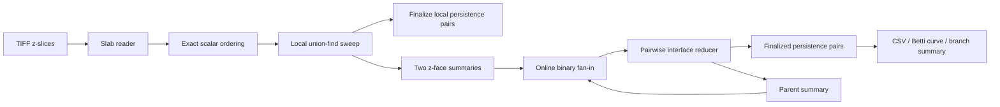

# Architecture

## Design goal

`stream_betti_curves` computes exact H0/H2 topological summaries on 3-D image stacks while keeping peak resident memory tied to **local slab size and a bounded interface frontier**, not the full volume depth.

The implementation intentionally keeps reference and optimized algorithms in one executable. Reference paths make correctness regressions observable; optimized paths are promoted only after exact multiset equivalence.

## Data flow



## H0 sublevel filtration

H0 tracks foreground connected components as voxels enter in increasing scalar order. The optimized F32 hierarchy uses:

- native 4-byte F32 order keys;
- a packed parent/rank union-find representation;
- reuse of the decoded F32 buffer as local birth storage;
- direct event sinks instead of whole-slab event vectors;
- elder-dominated attach finalization;
- terminal-free final reduction.

If a branch born at `b` attaches at death `d` to a boundary-connected component whose current birth `r <= b`, `[b,d)` is final. Future external connections can only make that surviving component older, so the younger branch cannot later become the elder survivor.

## H2 dual background model

H2 is computed through connected components of the strict background superlevel filtration, with one distinguished outside component. Foreground/background connectivity is dual:

| Foreground | Background |
|---:|---:|
| 6 | 26 |
| 26 | 6 |

The hierarchical H2 summary carries two z-faces plus sparse events describing finite attachments, outside connections, and surviving interface connectivity. The optimized reducer preserves this tie order at equal scalar value:

```text
outside -> attach -> interface -> cross
```

Direct cross consumption avoids writing, flushing, reopening, and rereading a temporary cross-interface run. Outside-dominated structural pruning replaces redundant interface edges with direct outside events when one endpoint is already outside-connected.

## Hierarchical fan-in

A flat global reducer keeps every slab interface until the end, so global state grows with the number of slabs. The hierarchical reducer composes adjacent block summaries online.

For two neighboring summaries:

```text
[left outer face | shared face] + [shared face | right outer face]
                         |
                         +-- becomes interior and is eliminated

parent summary = [left outer face | right outer face]
```

At most one completed summary is retained per binary-fan-in level. Consumed child runs are removed once their parent is durable.

### Frontier bound

If one image face contains `A = width * height` voxels, a pairwise merge needs at most four face arrays, so the explicit hierarchical reconciliation frontier is bounded by approximately `4A` nodes rather than `A * number_of_interfaces`.

For native F32 with packed parent/rank state:

```text
parent/rank word  4 bytes
birth key         4 bytes
-------------------------
                  8 bytes / pair node
```

For the measured 3792×3792 workload, `4A = 57,517,056` nodes, or about 0.43 GiB of explicit pair state.

## Disk-backed summaries

`BETTI_TEMP_DIR` selects the scratch location. Temporary event runs are binary, typed by key width, and removed when no longer needed. Final CSV output uses atomic same-directory temporary files before rename so an interrupted write does not overwrite a previous valid result.

## Exact scalar ordering

- U8/U16: integer order.
- F32/F64: order-preserving integer keys and stable radix ordering.
- `-0.0` and `+0.0`: one filtration value.
- NaN and infinities: rejected.

The scalar value ordering is part of the mathematical contract; optimization code may change representation but not ordering.

## Parallelism

Rayon parallelism is used where slabs or independent work units can be prepared concurrently. The local filtration sweep itself respects event order. Larger worker counts can increase memory because several slabs may be resident simultaneously, so thread count is an explicit benchmark dimension.

## Failure and safety model

Before topology work, checked size planning validates products and identifier limits. Unknown command-line options are rejected. Temporary runs and final outputs use checked I/O, and public optimized modes retain reference implementations for equivalence testing.

## Source map

| Area | Main modules |
|---|---|
| TIFF input / scalar values | `io.rs`, `io_scalar.rs`, `tiff_paths.rs`, `scalar.rs`, `scalar_order.rs` |
| Local connectivity | `union_find.rs`, `local_uf_state.rs`, `local_pruning.rs` |
| Interface reduction | `slab_interface.rs`, `interface_sparsify*.rs` |
| H0 persistence | `persistence_h0*.rs` |
| H2 persistence | `persistence_h2*.rs` |
| Event curves | `event_betti*.rs` |
| Branch summaries | `merge_tree_*.rs` |
| Tuning / configuration | `scalar_stream_tuning.rs`, `size_plan.rs` |
| Transactional output / runs | `atomic_output.rs`, `binary_io.rs`, `temp_runs.rs` |

## Hierarchical branch trees

The H0/H2 elder-rule branch-tree modes now have a shared hierarchical fan-in path. Unlike the historical event-order tree, the hierarchical result is plateau-canonical: positive branches that merge through the same equal-valued plateau point directly to the oldest branch that survives beyond that plateau. This makes the ancestry invariant to equal-value edge order and allows the same filtration-preserving interface sparsifier used by persistence.

The pair frontier remains bounded by a small multiple of one z-face. The current final `MergeTree` node table is still materialized, so branch-output size remains a separate memory term. See [`branch-tree-hierarchy.md`](branch-tree-hierarchy.md).
